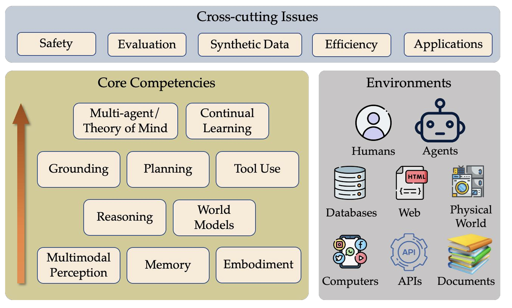

### Previous offering's student team projects: 
- [25 Spring course's students project github HERE](https://github.com/Qdata4Capstone/uva-25-spring-genai-students-projects/tree/main/students-projects-code)

- Related student projects from Students who took 2025 Fall Undergraduate Machine Learning 
[uva-machine-learning-25f-projects](https://github.com/Qdata4Capstone/uva-machine-learning-25f-projects)

### Each student team is expected to finish two different course projects. 
+ Each team need to deliver two different course projects
  - Course Project A: Build agents to benefit domains like healthcare, finance or .....
  - Course Project B: A deep dive project on a component of LLM agents or property of LLM agents ... 
  - Project B and be an exension from Course A (highly recommended!)

+ We will provide a sheet of project A ideas for your team to select or contribute from your own by third week, Plese select your team session in the signup sheets ! 
+ We will a sheet of project B ideas for your team to select or contribute from your own by sixth week, Plese select your team session in the signup sheets ! 


### Details on Course Project required artifacts: 

+ Each team includes up to three students 

+ Required Deliverables for Your Project:

  1. **Proposal Talk**: A mini presentation to the instructors on your project idea. The presentation should explain WHY / WHAT / HOW on your project — intended to be a more conceptual, idea-based pitch. Please use [the given template]({{ site.baseurl }}/Lectures/ProjPresentationTemplate-1.pptx) to help you pitch the idea.
    - We will provide a template for drafting this proposal talk deck. 

  2. **Slide Deck + Presentation**: A slide deck summarizing your project and describing your results. Filling in the template slide pages will be enough (more is better!). The slide deck should include your YouTube video link and your codebase GitHub PR information. Use [the given template]({{ site.baseurl }}/Lectures/ProjPresentationTemplate-1.pptx). Submit to Canvas.
    - We will provide a template for drafting this presentation talk deck. 

  3. **Codebase**: A python Jupyter notebook (or codebase format that you prefer) to present the code, data visualization, and obtain results and analysis through step-by-step code cell runs. Submit via Pull Request to the course project GitHub: [https://github.com/Qdata4Capstone/uva-machine-learning-25f-projects](https://github.com/Qdata4Capstone/uva-machine-learning-25f-projects)

  4. **Code Demo Video**: A video uploaded to YouTube demonstrating your codebase in action, walking through key functionality and results. To minimize overhead time cost during presentations (switching, wrong setup, etc.), we expect you to record this demo video. Please practice the whole process a few times before recording. Share the YouTube link in your Canvas submission.

  5. **Project Report Writeup**: A detailed written report including introduction, background, related work, experimental design, results, and comparison to baselines.
    - We will provide a template for drafting this report writeup. 


+ One the project proposal and final presentation slide decks: 
  - Good slide deck and Great delivery of content at the demo session     
  - Clear definition of problem and importance
  - Clear presentation of related work
  - Clear explanation of approach and code runs
  - Clear summary of results (and/or difficulties)
  - Well-organized, polished as a whole
  - Good video demo (hosted on youtube before your final demo day)

+ On the project report: 
  - Here is the grading rubrics we will use to grade your final report 
  - Clear definition of problem and importance
  - Clear presentation of related work
  - Clear explanation of approach
  - Clear summary of results (and/or difficulties)
  - Well-organized, polished as a whole


+ On your coding artifacts (aka also presented via demo presentation)
  + The project should be technical, employing methods including, but not limited to, those covered in class. Please keep your code and visualized results in well-organized code structure. 
  + Please following the following instruction for organizing your PR to the project codebase: [tocome](tocome)
  
    - Plese Follow the following folder structure to organize your team project artifacts:
    - Place all code scripts in the `src/` folder
    - Place all documentation in the `doc/` folder
    - A README.md will be helpful if you have one. 

```
team-x/
├── src/
└── doc/
```

+ How to PR to the project codebase: 

  - Step 1: Set up your local branch
    * Go to the course repository and click Fork: https://github.com/Qdata4Capstone/uva-machine-learning-25f-projects
    * Go to your new forked repository and clone it to your local environment:
      * `git clone https://github.com/<your-username>/uva-machine-learning-25f-projects.git`
    * Navigate into the cloned folder and add the original repository as an upstream remote:
      * `git remote add upstream https://github.com/Qdata4Capstone/uva-machine-learning-25f-projects.git`

  - Step 2: Prepare your code
    * For each team, please create a folder named `team-XX` corresponding to your team ID (e.g., team-1, team-11, team-111).
    * Inside this folder, include the following:
      * `src/`: A subfolder containing all source code.
      * `data/`: A subfolder with the data required to reproduce results.
          * Note: If the data cannot be uploaded, include a markdown file describing how to collect it.
      * `requirements.txt`: A file listing required packages. (Format reference)
      * `README.md`: A markdown file describing the folder content. You can view an example here. Your README should include:
          * Project Title
          * Team ID and Members
          * Overview: A brief introduction to the project.
          * Usage: How to run the code to get core results.
          * Setup: Instructions for environment setup (if non-trivial).
          * Video demo: A link to your demo video with a brief description.

      * You are also welcome to include additional files or documentation in the folder or README.md if they help people better understand your project and code.

  - Step 3: Upload your code
    * Commit your changes (no requirements on the commit message)
      * `git add .`
      * `git commit -m "upload project code by Team-XX"`
    * Push the changes to your fork
      * `git push origin main`
    * On GitHub, navigate to your fork and open a pull request via: Pull requests → New pull request


<hr> 


#### Looking forward to your demos and artifacts! 


---


## Course Project A: Build agents to benefit domains like healthcare, finance or .....

+ Please select an appliation domain to build an end to end LLM agent 
+ or building Evaluation Infrastructure / Benchmarks and testing frameworks for emerging domains lacking standardized evaluation.
 
+ Example domains include like the following and many more : 


+ **Software Engineering**
  - The most mature domain with 79.2% benchmark success. Tools like GitHub Copilot and Claude Code have millions of users.
  -  Project Ideas: Code review agents, documentation generators, test generation, refactoring assistants, debugging agents, multi-language code translators.
  -  Evaluation: SWE-bench, HumanEval, MBPP
  -  Challenges: Long-horizon planning, complex dependencies, multi-file consistency

+ **Customer Service**
  - Widely deployed with user preference for AI responses over human-written ones.
  - Project Ideas: Multi-turn conversation agents, ticket routing systems, sentiment-aware responders, cross-platform coordinators, proactive outreach agents.
  - Evaluation: Resolution time, satisfaction metrics, escalation accuracy
  - Challenges: Emotional intelligence, appropriate escalation, ambiguous requests

+ **Healthcare**
  - Med-PaLM 2 achieves expert-level performance on medical exams. Regulatory barriers limit deployment.
  - Project Ideas: Medical literature summarizers, patient education agents, symptom triage systems, clinical note assistants, drug interaction checkers.
  - Evaluation: MedQA, PubMedQA, clinical case datasets
  - Challenges: Hallucination prevention, explainability, regulatory compliance

+ **Finance**
  - Deployed in risk-controlled environments for trading, fraud detection, and document analysis.
  - Project Ideas: Financial document analyzers (10-K, 10-Q), fraud detection agents, market sentiment analyzers, compliance checkers, personal finance advisors.
  - Evaluation: Financial accuracy metrics, backtesting, compliance tests
  - Challenges: Audit trails, explainability requirements, market uncertainty

+ **Data Science**
  - AutoML platforms demonstrate full lifecycle automation from exploration through deployment.
  - Project Ideas: Automated EDA agents, feature engineering assistants, model selection agents, data quality auditors, pipeline debuggers, results interpreters.
  - Evaluation: Kaggle competitions, domain benchmarks, reproducibility tests
  - Challenges: Fairness and bias, domain-specific distributions, reproducibility

+ **Legal**
  - Emerging applications with trustworthiness and jurisdictional complexity as barriers.
  - Project Ideas: Legal research agents, contract analyzers, document drafters, compliance monitors, case outcome predictors, legal Q&A systems.
  - Evaluation: Legal accuracy assessments, expert review, jurisdiction tests
  - Challenges: Trustworthiness verification, legal nuance, ethical governance

+ **Manufacturing**
  - Factory-specific pilots with natural language interfaces to complex systems.
  - Project Ideas: Equipment troubleshooters, predictive maintenance schedulers, quality control assistants, process optimizers, safety compliance checkers.
  - Evaluation: Domain expert validation, simulation testing, factory metrics
  - Challenges: Safety-critical decisions, legacy system integration, domain expertise

+ **Materials Science**
  - LitMOF curated over 118K structures and discovered thousands of unreported materials.
  - Project Ideas: Literature mining agents, property predictors, synthesis pathway suggesters, database curators, experiment design agents.
  - Evaluation: Scientific validation, expert review, reproducibility testing
  - Challenges: Scientific accuracy, experimental uncertainty, physical validation

+ **Urban Planning**
  - City-scale simulations enable policy analysis and behavioral modeling in academic settings.
  - Project Ideas: Traffic optimizers, resource allocators, policy impact simulators, community feedback analyzers, emergency response coordinators.
  - Evaluation: Simulation validation, historical comparison, expert assessment
  - Challenges: Deployment scale, ethical considerations, behavioral model validation


---

<hr>


## Course Project B: A deep dive project on a component of LLM agents or property of LLM agents 

+ Please select a project to deep dive one component of LLM agents as follows: 
  - **1 (Foundations & LLMs):** Grasp the fundamental concepts and architecture of LLM agents
  - **2 (Brain & Reasoning):** Understand the core LLM capabilities that enable agentic behavior
  - **3 (Perception):** Learn how agents process multimodal and domain-specific inputs
  - **4 (Memory):** Master memory architectures and knowledge management systems
  - **5 (Action & Tools):** Develop skills in tool integration and agent-computer interfaces
  - **6 (World Models):** Explore how agents build internal representations of their environment
  - **7 (Planning):** Study planning algorithms and task orchestration strategies
  - **8 (Multi-Agent):** Understand collaborative agent systems and communication protocols
  - **9 (Safety):** Address ethical, safety, and alignment challenges in agent deployment
  - **10 (Training):** Learn optimization and customization techniques
  - **11 (Deployment):** Understand production infrastructure and serving systems

+ Alternatively, you can also select a project to deep dive one aspect of LLM agents on Cross-Domain Projects like 
  - Multi-Agent Coordination / Systems where specialized agents collaborate (literature review + data analysis + writing agents).
  - Human-AI Collaboration / Interfaces combining human expertise with agent capabilities, including handoff mechanisms.
  - Explainability Frameworks / Agents that explain reasoning in domain-appropriate ways for healthcare, finance, or legal contexts.
  - Error Detection and Recovery / Meta-agents monitoring other agents for mistakes and implementing corrections.
  - Domain Adaptation / Methods for adapting general-purpose agents to specialized domains with limited data.

+ Overall framework to think about LLM agents (credit: ICLR24 LLM agents workshop) 



